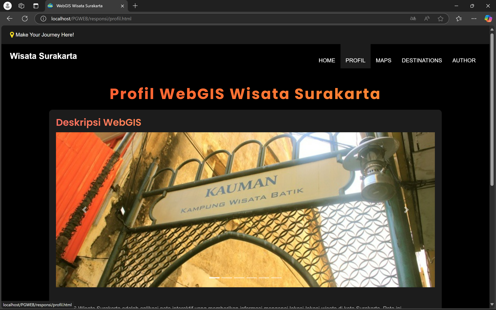

# WebGIS Objek Wisata Kota Surakarta

WebGIS ini merupakan aplikasi peta interaktif yang dirancang untuk memvisualisasikan lokasi-lokasi objek wisata di Kota Surakarta. Aplikasi ini bertujuan memberikan informasi yang mudah diakses oleh masyarakat dan wisatawan tentang destinasi wisata yang ada, termasuk deskripsi, foto, dan detail penting lainnya.

## Tujuan
- **Meningkatkan Aksesibilitas Informasi Wisata**: Mempermudah pengguna untuk menemukan dan mengetahui lokasi serta informasi objek wisata di Kota Surakarta.
- **Promosi Pariwisata**: Mendukung pengembangan sektor pariwisata di Kota Surakarta dengan menyediakan platform digital yang modern dan informatif.
- **Kemudahan Navigasi**: Memberikan panduan visual berbasis peta yang dapat membantu wisatawan merencanakan kunjungannya.
- **Menambahkan Objek Wisata Hidden Gem**: Menampilkan destinasi wisata tersembunyi (hidden gem) di Kota Surakarta yang ditambahkan oleh pengguna untuk memberikan pengalaman unik kepada wisatawan.

## Komponen Pembangun Produk
- **HTML**: Untuk struktur dasar halaman web.
- **CSS**: Untuk desain dan tata letak halaman.
- **PHP**: Untuk logika backend dan interaksi dengan database.
- **Bootstrap**: Untuk mendukung tampilan responsif dan estetis.
- **Database MySQL**: Untuk penyimpanan data destinasi wisata.
- **Font Awesome**: Untuk ikon tambahan pada antarmuka.
- **LeafletJS**: Library JavaScript untuk menampilkan peta interaktif.
- **JavaScript**: Untuk interaksi dinamis di sisi klien.

## Sumber Data
- **GeoServer**: Untuk menyediakan layanan web pemetaan (WMS/WFS).
- **GeoJSON**: Untuk menyimpan dan menampilkan data geospasial.

## Tampilan Penting
- **Halaman Utama**
Halaman utama WebGIS Wisata Surakarta ini memuat berbagai elemen penting yang memberikan gambaran awal tentang tujuan dan fungsi sistem. Pada bagian atas halaman, terdapat navigasi menu dengan beberapa pilihan, seperti HOME, PROFIL, MAPS, DESTINATIONS, dan AUTHOR, yang memudahkan pengguna berpindah ke berbagai halaman dalam sistem. Judul utama yang ditampilkan adalah "Persebaran Objek Wisata Kota Surakarta," dengan deskripsi tambahan yang menjelaskan bahwa WebGIS ini menampilkan informasi persebaran lokasi objek wisata di Surakarta dan sekitarnya. Pengguna dapat mengetahui detail lengkap seperti lokasi wisata, koordinat, dan alamat melalui peta yang disediakan.

- **Profil**
Halaman Profil pada WebGIS Wisata Surakarta memuat tiga informasi utama yang penting bagi pengguna. Pertama, deskripsi WebGIS yang menjelaskan tujuan dibuatnya sistem ini sebagai platform interaktif untuk menampilkan persebaran objek wisata di Kota Surakarta beserta informasi seperti lokasi, koordinat, dan alamat wisata. Kedua, halaman ini menjelaskan sumber data yang digunakan, yaitu berasal dari hasil survei lapangan, data resmi Dinas Pariwisata, dan sumber spasial lainnya yang diolah menjadi peta digital. Terakhir, terdapat panduan cara penggunaan WebGIS yang mencakup langkah-langkah navigasi peta, seperti zoom in/zoom out, mencari lokasi, serta melihat informasi detail melalui popup yang muncul saat mengklik titik lokasi wisata. Dengan halaman profil ini, pengguna dapat memahami tujuan, keakuratan data, dan cara memanfaatkan fitur WebGIS secara optimal.

- **Maps**
Halaman Maps pada WebGIS Wisata Surakarta memuat informasi detail mengenai persebaran objek wisata di Kota Surakarta. Informasi tersebut mencakup titik lokasi wisata yang disajikan dalam bentuk marker interaktif dari sumber data GeoJSON, serta area atau batasan wilayah yang divisualisasikan menggunakan poligon. Selain itu, peta ini juga menampilkan jaringan jalan yang diambil melalui layanan GeoServer, sehingga memberikan tampilan spasial yang lengkap dan informatif. Setiap titik lokasi wisata dilengkapi dengan popup detail yang berisi nama objek wisata, alamat lengkap, tautan untuk informasi tambahan, serta navigasi langsung ke Google Maps. Dengan kombinasi data GeoJSON untuk titik lokasi, poligon untuk area, dan GeoServer untuk jaringan jalan, halaman ini memudahkan pengguna dalam menemukan dan memahami persebaran destinasi wisata di Kota Surakarta secara visual dan interaktif.

- **Tabel**
Halaman Destinations pada WebGIS Wisata Surakarta memuat daftar lengkap objek wisata di Kota Surakarta beserta detail informasinya. Informasi yang ditampilkan meliputi ID objek, Nama Objek Wisata, Alamat lengkap, Koordinat Longitude dan Latitude dari setiap objek wisata. Setiap baris data dilengkapi dengan aksi berupa tombol Edit untuk memperbarui data dan tombol Hapus untuk menghapus data yang tidak diperlukan. Halaman ini memungkinkan pengelolaan data wisata secara mudah dan sistematis.

WebGIS ini diharapkan dapat menjadi media digital yang bermanfaat bagi pemerintah daerah, pelaku pariwisata, dan masyarakat dalam mendukung pengelolaan serta pengembangan potensi wisata di Kota Surakarta.
